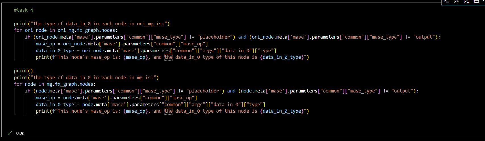

# Lab 2
1. Explain the functionality of report_graph_analysis_pass and its printed jargons such as placeholder, get_attr ... 

>* The result of function report_graph_analysis_pass on the model we trained in lab1 is shown as follows.
>* As it's shown in the result, the function report the graph generated on the network, the architecture of the tiny network, and the type and hyper parameters in each layers.
>* The meanings of the printed jargons are shown as follows.
>>+ "placeholder" repersent the input of the graph.
> > + "get_attr" retrieves a parameter from the module hierarchy.
>> + "call_module" applies a operation to the input and output the result such as "relu", "linear", and "batchnorm1d".
>>+ "output" contains the output of the traced function in its args[0] attribute.

2.	What are the functionalities of profile_statistics_analysis_pass and report_node_meta_param_analysis_pass respectively?
* The functionality of "profile_statistics_analysis_pass" is to retrieve the weight statistics and  act statistics in each node of the graph and profile them.
* The trucated result of report_node_meta_param_analysis_pass on the "jsc-tiny" model we train in lab1 is shown as follows.

As we can refer from the graph, "report_node_meta_param_analysis_pass" present the detailed statistics of each node in the graph of the network including the "min", "max", "count" and "range" of the input of a "relu" layer, and the "count","variance", and "mean" of the weight of a linear layer.

3.	Explain why only 1 OP is changed after the quantize_transform_pass.
* In the above task, we found out the architecture of the "jsc-tiny" model which concludes only one linear node. The influence of the pass we used is to quantize the linear node and change its datatype into "integer" with the precision we set. Since there is only one linear node in the gragh, there's inly 1 OP changed after the quantize_transform_pass.

4.	Write some code to traverse both mg and ori_mg, check and comment on the nodes in these two graphs. You might find the source code for the implementation of summarize_quantization_analysis_pass useful.
* The code I wrote to traverse both mg and ori_mg is shown as follows.

5. Perform the same quantisation flow to the bigger JSC network that you have trained in lab1. You must be aware that now the `pass_args` for your custom network might be different if you have used more than the `Linear` layer in your network.

6. Write code to show and verify that the weights of these layers are indeed quantised. You might need to go through the source code of the implementation of the quantisation pass and also the implementation of the [Quantized Layers](../../machop/chop/passes/transforms/quantize/quantized_modules/linear.py) .

7. Load your own pre-trained JSC network, and perform perform the quantisation using the command line interface.

8. (Optional) Implement a pass to count the number of FLOPs (floating-point operations) and BitOPs (bit-wise operations).